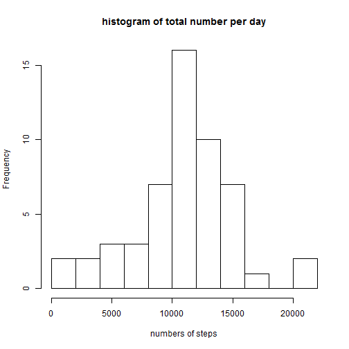

Assignment 1
=============

###Loading and preprocessing the data


```r
setwd("D:/R programming/RepData_PeerAssessment1")
unzip("activity.zip")
act<-read.csv("activity.csv")
library(dplyr)
library(date)
library(lattice)
library(ggplot2)
```

###Calculate the mean total number of steps taken per day.

1.Calculate the  total number of steps taken per day


```r
groupact<-group_by(act,date)
sumact<-summarise(groupact,tnpd=sum(steps))
head(sumact,4)
```

```
## Source: local data frame [4 x 2]
## 
##         date  tnpd
##       (fctr) (int)
## 1 2012-10-01    NA
## 2 2012-10-02   126
## 3 2012-10-03 11352
## 4 2012-10-04 12116
```

2.Histogram of the total number steps per day


```r
hist(sumact$tnpd,main = "histogram of total number per day",xlab = "numbers of steps",breaks=10)
```

 

3. mean and median of the total number of steps taken per day


```r
mean<-mean(sumact$tnpd,na.rm = TRUE)
median<-median(sumact$tnpd,na.rm = TRUE)
```

The mean of the total number of steps per day is 1.0766189 &times; 10<sup>4</sup>. And the median is 10765.

###the average daily activity pattern

1.  time series plot of the 5-minute interval and the average number of steps taken


```r
intervaldata<-group_by(act,interval)
averagedata<-summarise(intervaldata,ave=mean(steps,na.rm = TRUE))
with(data = averagedata,plot(x=interval,y=ave,main = "Time series plot",xlab = "time interval",ylab = "average number",type = "l"))
```

 

2. 5-mintnue interval which contains the maximum number of steps.


```r
sortaverage<-arrange(averagedata,desc(ave))
maxinterval<-sortaverage[1,1]
```

So the 5-mintnue interval which contains the maximum number of steps is 835

###Imputing missing values

1.  the total number of missing values in the dataset


```r
nna<-nrow(act[act$steps=="NA",])
```
The total number of missing values in the dataset is 2304

2. a strategy for filling in all of the missing values in the dataset.


```r
#I use the 5 minute interval average to fill the missing values
#merge act with averagedata
mergedata<-merge(act,averagedata,by.x=3,by.y=1)
for(i in which(is.na(mergedata$steps))){
  mergedata$steps[i]<-mergedata$ave[i]
}
```

3. new dataset that is equal to the original dataset but with the missing data filled in


```r
#the new dataset is newact that created in the above procesure.
newact<-data.frame(mergedata[,c(1:3)])
head(mergedata,4)
```

```
##   interval    steps       date      ave
## 1        0 1.716981 2012-10-01 1.716981
## 2        0 0.000000 2012-11-23 1.716981
## 3        0 0.000000 2012-10-28 1.716981
## 4        0 0.000000 2012-11-06 1.716981
```

4. histogram of the total number of steps taken each day and the mean and median total number of steps taken per day


```r
groupnewact<-group_by(newact,date)
sumnewact<-summarise(groupnewact,newtnpd=sum(steps))
hist(sumnewact$newtnpd,xlab = "numbers of steps",main = "steps per day (with missing data)",breaks=10)
```

 


```r
newmean<-mean(sumnewact$newtnpd)
newmedian<-median(sumnewact$newtnpd)
```

The mean of the total number steps per day is 1.0766189 &times; 10<sup>4</sup>. The median is 1.0766189 &times; 10<sup>4</sup> The mean is the same with the first part of the assignment, while the median is a little different.After imputing missiing data, there have more data concentrate in the mean.

###differences in activity patterns between weekdays and weekends

1. Create a new factor variable in the dataset with two levels (C !0weekday!1 and !0weekend!1


```r
newact$date<-as.character(newact$date)
newact$date<-as.date(newact$date,order = "ymd")
newact$date<-as.POSIXlt(newact$date,format="%Y-%M-%D")
Sys.setlocale(category = "LC_ALL",locale = "C")
```

```
## [1] "C"
```

```r
newact<-mutate(newact,weekdays=weekdays(date))
week<-function(x){ifelse(x=="Sunday","weekend",ifelse(x=="Saturday","weekend","weekday"))}
newact<-mutate(newact,weekdaylevel=week(weekdays))
head(newact,4)
```

```
##   interval    steps                date weekdays weekdaylevel
## 1        0 1.716981 2012-10-01 08:00:00   Monday      weekday
## 2        0 0.000000 2012-11-23 08:00:00   Friday      weekday
## 3        0 0.000000 2012-10-28 08:00:00   Sunday      weekend
## 4        0 0.000000 2012-11-06 08:00:00  Tuesday      weekday
```


2. a time series plot of the 5-minute interval (x-axis) and the average number of steps taken, averaged across all weekday days or weekend days


```r
newact2<-select(newact,c(-3,-4))
groupnewact2<-group_by(newact2,interval,weekdaylevel)
sumnewact2<-summarise(groupnewact2,newave=mean(steps))
ggplot(data = sumnewact2,aes(interval,newave))+geom_line()+facet_wrap(~weekdaylevel,nrow = 2,ncol = 1)
```

 


